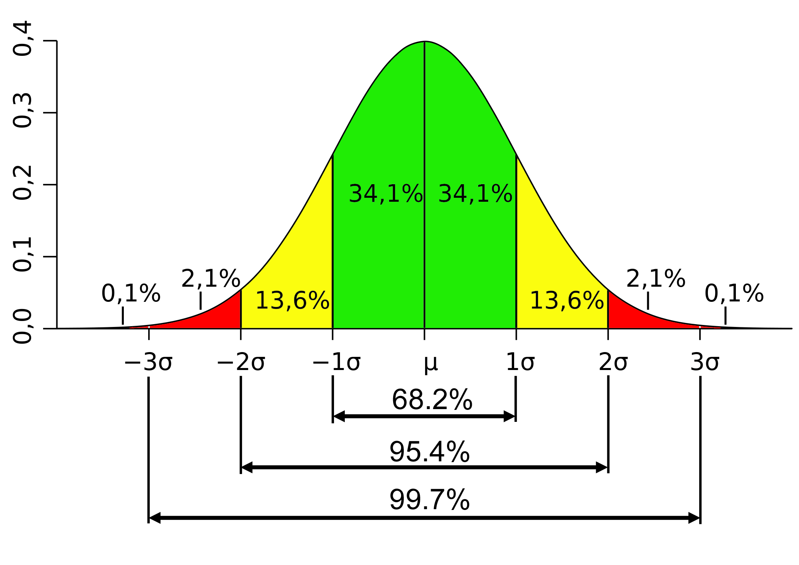

```{r setup, include=FALSE}
knitr::opts_chunk$set(echo = FALSE)

library(rstan)
library(bayesplot)
library(dplyr)
library(feather)

```

## The Walk
<div style="width:450px; height=300px">

</div>

## The Normal Distribution
<div style="width:450px; height=300px">

</div>

All data is normally distributed... except when it isn't.

## 0.05
<div style="width:450px; height=300px">

</div>

The p value tells all... except when it doesn't (and how did you get 846 degrees of freedom in your error term?).

## Confidence Intervals
<div style="width:450px; height=300px">

</div>

NHST confidence intervals will clarify all... after two or three months of explaining NHST confidence intervals.

## Continuous Variables

All data is continuous... except when it isn't.

## R. A. Fisher Says
<div style="width:450px; height=300px">

</div>

What would Fisher do?